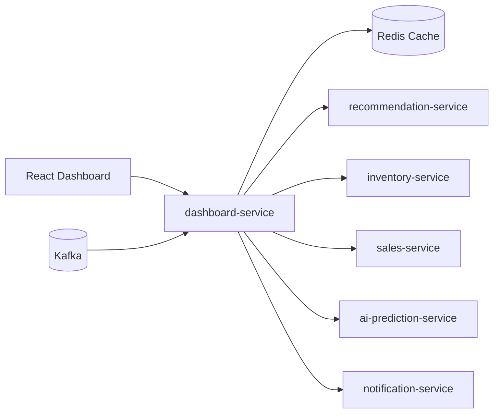
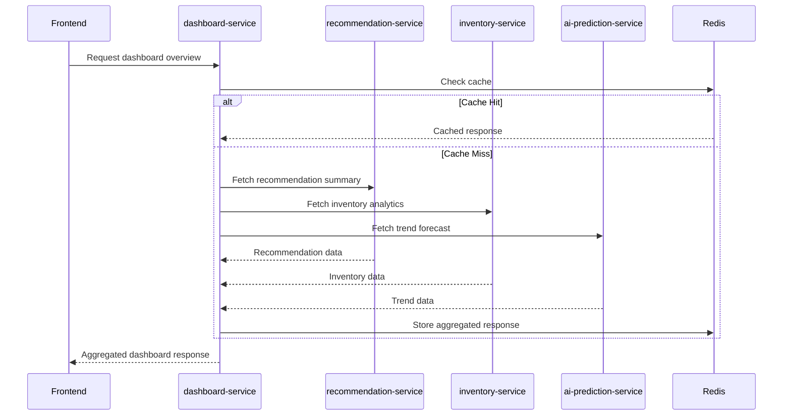
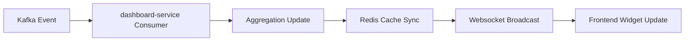

# dashboard-service Architecture & Design Document

## Table of Contents

1. Service Overview
2. Dashboard Goals
3. BFF Architecture Responsibilities
4. Dashboard Widget Architecture
5. Analytics Aggregation Flow
6. API Aggregation Strategy
7. Realtime Dashboard Update Flow
8. Redis Cache Strategy
9. Kafka Integration Design
10. Performance Optimization
11. Frontend Synchronization Strategy
12. Fault Tolerance & Reliability
13. Security Considerations
14. Future Scalability & Extensibility
15. Observability & Monitoring
16. Real Business Scenarios

---

# 1. Service Overview

## Purpose

`dashboard-service` acts as the Backend-For-Frontend (BFF) layer for analytics dashboards within the engagement domain.

The service is responsible for:

- Aggregating analytics data from multiple services
- Providing frontend-optimized APIs
- Reducing frontend orchestration complexity
- Supporting realtime dashboard updates
- Managing analytics caching strategies
- Coordinating event-driven synchronization
- Optimizing dashboard response performance

---

## Architectural Role

The dashboard-service exists as a dedicated BFF layer to isolate frontend concerns from core business services.

Instead of allowing frontend applications to directly communicate with multiple backend services, dashboard-service centralizes:

- data aggregation
- response composition
- caching
- websocket synchronization
- frontend-specific DTO mapping

This improves:

- maintainability
- scalability
- frontend performance
- API consistency
- dashboard responsiveness

---

## Why dashboard-service Exists Separately

| Concern | Reason |
|---|---|
| Frontend Optimization | Frontend requires aggregated and chart-ready data |
| Reduced API Calls | Multiple service calls are consolidated |
| Realtime Updates | Centralized websocket coordination |
| Caching | Analytics caching handled independently |
| Decoupling | Frontend isolated from internal microservice complexity |
| Scalability | Dashboard traffic scaled independently |

---

## High-Level Architecture



---

# 2. Dashboard Goals

## Operational Visibility

Provide centralized business visibility across:

- inventory performance
- recommendation effectiveness
- sales analytics
- trend forecasting
- realtime alerts

---

## Realtime Monitoring

Enable realtime operational awareness through:

- websocket updates
- Kafka event synchronization
- incremental dashboard refreshes
- realtime alerts

---

## Decision Support

The dashboard should help business operators:

- identify inventory risks
- monitor trending products
- evaluate recommendations
- track sales performance
- respond quickly to market changes

---

## Frontend Optimization Goals

| Goal | Description |
|---|---|
| Low Latency | Reduce dashboard loading time |
| Aggregated Responses | Minimize frontend API orchestration |
| Chart-Ready Data | APIs optimized for visualization |
| Realtime Synchronization | Reduce manual refresh requirements |
| Scalability | Handle large dashboard traffic |

---

# 3. BFF Architecture Responsibilities

## Core Responsibilities

### API Aggregation

Combine data from:

- recommendation-service
- inventory-service
- ai-prediction-service
- sales-service
- notification-service

into frontend-ready responses.

---

### Frontend DTO Optimization

dashboard-service exposes DTOs specifically optimized for:

- charts
- widgets
- analytics cards
- trend graphs
- realtime indicators

---

### Frontend Complexity Reduction

Without BFF:

Frontend would need:

- multiple REST calls
- aggregation logic
- retry handling
- synchronization management

With dashboard-service:

Frontend only communicates with:

- dashboard APIs
- websocket streams

---

## Example Aggregated Response

```json
{
  "success": true,
  "data": {
    "inventoryRisk": {
      "highRiskItems": 152,
      "criticalItems": 48
    },
    "trendForecast": {
      "topTrendingCategory": "Streetwear",
      "trendScore": 92.4
    },
    "recommendations": {
      "clearance": 21,
      "restock": 12
    }
  },
  "timestamp": "2026-05-19T10:30:00Z"
}
```

---

# 4. Dashboard Widget Architecture

## Trend Forecast Widget

| Field | Description |
|---|---|
| Purpose | Visualize future fashion trends |
| Data Source | ai-prediction-service |
| Refresh Strategy | Event-driven + periodic refresh |
| Cache Strategy | Redis cache (5 minutes TTL) |
| Realtime Updates | TrendDetectedEvent |

---

## Inventory Risk Widget

| Field | Description |
|---|---|
| Purpose | Show inventory risk levels |
| Data Source | inventory-service |
| Refresh Strategy | Kafka-triggered refresh |
| Cache Strategy | Redis aggregation cache |
| Realtime Updates | InventoryRiskDetectedEvent |

---

## Recommendation Insights Widget

| Field | Description |
|---|---|
| Purpose | Show generated recommendations |
| Data Source | recommendation-service |
| Refresh Strategy | Incremental realtime updates |
| Cache Strategy | Cached recommendation summaries |
| Realtime Updates | RecommendationGeneratedEvent |

---

## Sales Analytics Widget

| Field | Description |
|---|---|
| Purpose | Sales performance monitoring |
| Data Source | sales-service |
| Refresh Strategy | Scheduled aggregation |
| Cache Strategy | Daily/hourly cache |
| Realtime Updates | Optional partial updates |

---

## Realtime Alerts Widget

| Field | Description |
|---|---|
| Purpose | Operational notifications |
| Data Source | notification-service |
| Refresh Strategy | Fully realtime |
| Cache Strategy | Short TTL cache |
| Realtime Updates | Websocket broadcasting |

---

# 5. Analytics Aggregation Flow

## Aggregation Workflow



---

## Aggregation Strategy

### Synchronous Aggregation

Used for:

- dashboard page loading
- analytics overview
- detailed reports

Advantages:

- consistent responses
- immediate freshness

Trade-offs:

- dependency latency
- timeout handling required

---

### Event-Driven Synchronization

Used for:

- realtime updates
- alert refreshes
- widget synchronization

Advantages:

- lower latency updates
- reduced polling
- better scalability

---

## Partial Failure Handling

If one service fails:

- return partial dashboard data
- mark unavailable sections
- avoid total dashboard failure

Example:

```json
{
  "inventoryWidget": {
    "status": "AVAILABLE"
  },
  "trendWidget": {
    "status": "UNAVAILABLE"
  }
}
```

---

# 6. API Aggregation Strategy

## Aggregation Endpoints

| Endpoint | Purpose |
|---|---|
| GET /api/dashboard/overview | Main dashboard summary |
| GET /api/dashboard/trends | Trend analytics |
| GET /api/dashboard/recommendations | Recommendation insights |
| GET /api/dashboard/inventory-risk | Inventory risk analytics |
| GET /api/dashboard/alerts | Realtime alerts |

---

## Pagination Aggregation

Dashboard-service normalizes pagination across multiple services.

Example:

```json
{
  "page": 0,
  "size": 10,
  "totalElements": 120,
  "totalPages": 12,
  "content": []
}
```

---

## Response Shaping

dashboard-service transforms internal service responses into:

- chart-friendly DTOs
- lightweight frontend payloads
- normalized structures

---

# 7. Realtime Dashboard Update Flow

## Realtime Synchronization Workflow



---

## Incremental Updates

Prefer partial updates over full dashboard refreshes.

Example:

- Only refresh Recommendation Widget after RecommendationGeneratedEvent
- Avoid reloading entire dashboard

---

## Full Refresh Scenarios

Required when:

- multiple widgets affected
- cache inconsistency detected
- major analytics recalculation occurs

---

## Concurrency Considerations

Potential issues:

- duplicate events
- stale cache
- out-of-order updates

Mitigation:

- event timestamps
- idempotent processing
- version tracking

---

# 8. Redis Cache Strategy

## Cacheable Data

| Data | TTL |
|---|---|
| Dashboard Overview | 5 minutes |
| Trend Forecast | 10 minutes |
| Recommendation Summary | 3 minutes |
| Alerts | 30 seconds |
| Widget Aggregation | 2 minutes |

---

## Redis Key Naming Convention

```text
 dashboard:overview
 dashboard:trend:forecast
 dashboard:recommendation:summary
 dashboard:inventory:risk
 dashboard:alerts
```

---

## Cache Invalidation Strategy

Cache invalidated when:

- Kafka update event received
- recommendation generated
- trend recalculated
- inventory risk changed

---

## Cache Consistency Strategy

Approach:

- write-through updates
- event-driven invalidation
- short TTL fallback

---

# 9. Kafka Integration Design

## Consumed Events

| Event | Purpose |
|---|---|
| RecommendationGeneratedEvent | Update recommendation widgets |
| TrendDetectedEvent | Refresh trend analytics |
| InventoryRiskDetectedEvent | Refresh inventory risk dashboard |
| NotificationTriggeredEvent | Update alerts widget |

---

## Kafka Topics

| Topic | Description |
|---|---|
| recommendation-events | Recommendation updates |
| trend-events | Trend analytics updates |
| inventory-events | Inventory analytics updates |
| notification-events | Realtime alerts |

---

## Consumer Groups

```text
 dashboard-service-group
```

---

## Idempotent Event Handling

Strategies:

- eventId tracking
- duplicate suppression
- version comparison

---

# 10. Performance Optimization

## Key Optimization Goals

| Metric | Target |
|---|---|
| Dashboard Response Time | < 2 seconds |
| Widget Refresh Delay | < 1 second |
| Websocket Push Delay | < 500ms |
| Cache Hit Ratio | > 80% |

---

## Optimization Strategies

### Async Aggregation

Use parallel service calls to reduce latency.

### Cached Aggregations

Avoid recomputing expensive analytics.

### Incremental Updates

Refresh only affected widgets.

### Lightweight DTOs

Minimize payload size.

---

# 11. Frontend Synchronization Strategy

## Websocket Subscription Model

Frontend subscribes to:

```text
/dashboard/updates
/dashboard/alerts
/dashboard/trends
```

---

## Reconnect Strategy

When websocket disconnects:

- automatic reconnect
- missed event recovery
- fallback polling

---

## Stale State Handling

Frontend periodically validates:

- widget timestamps
- cache freshness
- synchronization state

---

# 12. Fault Tolerance & Reliability

## Timeout Strategy

| Service Type | Timeout |
|---|---|
| Internal REST Calls | 2 seconds |
| Aggregation Calls | 5 seconds |
| Cache Operations | 500ms |

---

## Degraded Dashboard Mode

If dependencies fail:

- partial data returned
- unavailable widgets disabled
- stale cache used temporarily

---

## Retry Handling

Retry policies:

- transient failures retried
- exponential backoff
- circuit breaker integration

---

# 13. Security Considerations

## JWT Authentication

All dashboard APIs protected using JWT authentication.

---

## Role-Based Access

Example roles:

| Role | Access |
|---|---|
| ADMIN | Full analytics |
| MANAGER | Operational dashboards |
| STAFF | Limited analytics |

---

## Websocket Security

Security mechanisms:

- JWT validation during handshake
- subscription authorization
- rate limiting

---

# 14. Future Scalability & Extensibility

## Future Expansion Support

Architecture designed to support:

- additional dashboard widgets
- AI-driven personalization
- mobile dashboards
- multi-tenant analytics
- advanced BI integrations

---

## Distributed Websocket Scaling

Future scalability strategies:

- Redis pub/sub
- websocket clustering
- horizontal scaling
- sticky session handling

---

# 15. Observability & Monitoring

## Metrics Collection

| Metric | Purpose |
|---|---|
| Dashboard Latency | API performance |
| Cache Hit Rate | Redis efficiency |
| Websocket Connections | Realtime monitoring |
| Kafka Consumer Lag | Event processing health |
| Aggregation Failure Rate | Reliability tracking |

---

## Monitoring Stack

| Tool | Purpose |
|---|---|
| Prometheus | Metrics collection |
| Grafana | Visualization dashboards |
| Centralized Logging | Error investigation |

---

# 16. Real Business Scenarios

## Scenario 1: Sudden Fashion Trend Spike

Workflow:

1. ai-prediction-service detects trend spike
2. TrendDetectedEvent published
3. dashboard-service consumes event
4. Trend Widget cache updated
5. websocket broadcast triggered
6. frontend updates realtime chart

---

## Scenario 2: High Inventory Risk Alert

Workflow:

1. inventory-service detects overstock risk
2. InventoryRiskDetectedEvent published
3. dashboard-service refreshes risk analytics
4. alerts widget updated
5. managers receive realtime dashboard notification

---

## Scenario 3: Recommendation Analytics Refresh

Workflow:

1. recommendation-service generates clearance recommendation
2. RecommendationGeneratedEvent published
3. dashboard-service updates recommendation insights
4. frontend recommendation widget refreshed incrementally

---

## Scenario 4: Partial Service Outage

Workflow:

1. ai-prediction-service becomes unavailable
2. dashboard-service timeout triggered
3. stale cache used temporarily
4. dashboard displays degraded widget state
5. remaining widgets continue operating normally

---

# Conclusion

The dashboard-service acts as a scalable Backend-For-Frontend layer optimized for realtime analytics dashboards.

The architecture prioritizes:

- frontend performance
- loose coupling
- realtime synchronization
- aggregation efficiency
- scalability
- maintaina