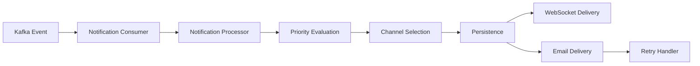
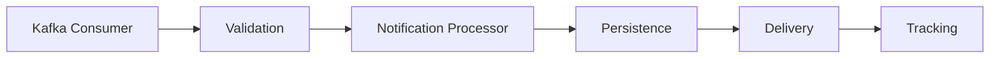
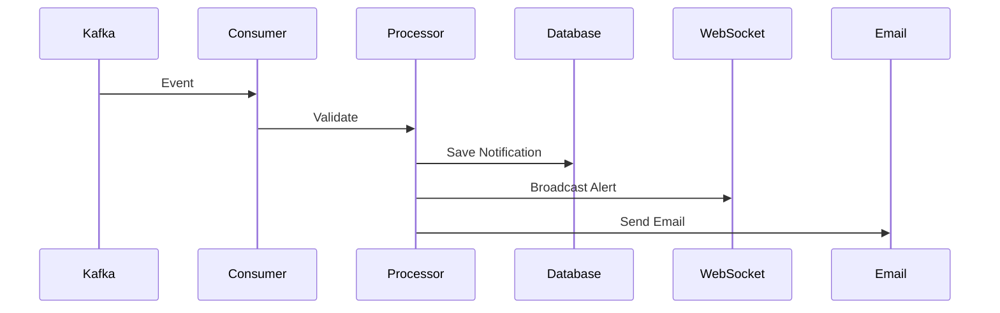
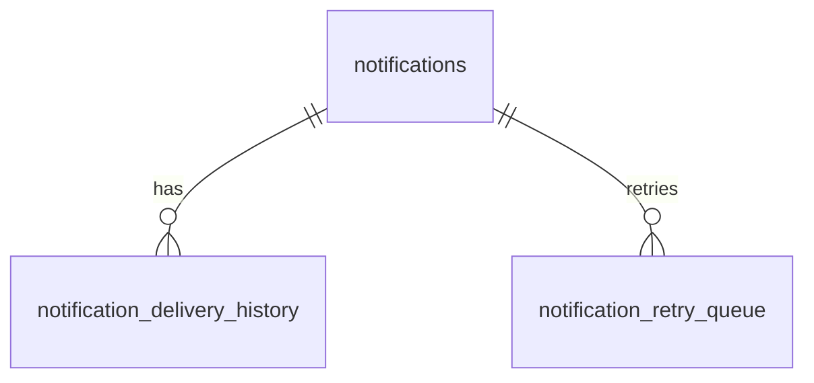

# notification-service/docs/

```text
notification-service/
└── docs/
    ├── 01-business-analysis.md
    ├── 02-event-flow.md
    └── 03-database-design.md
```

---

# 01-business-analysis.md

```md
# Notification Service Business Analysis

## Table of Contents

1. Service Overview
2. Business Goals
3. Notification Responsibilities
4. Notification Categories
5. Notification Workflow
6. Trigger Conditions
7. Notification Priority & Severity
8. Delivery Channels
9. Business Rules
10. Real Business Scenarios
11. Operational Constraints
12. Conclusion

---

# 1. Service Overview

## Purpose

The `notification-service` is responsible for delivering realtime and asynchronous operational notifications across the platform.

The service transforms backend business events into actionable alerts for operational teams and dashboards.

---

## Core Responsibilities

- Consume Kafka business events
- Generate operational alerts
- Send realtime websocket notifications
- Send email notifications
- Track delivery status
- Persist notification history
- Support retry workflows
- Support dashboard synchronization

---

# 2. Business Goals

| Goal | Description |
|---|---|
| Improve operational awareness | Realtime alerts for inventory and trend events |
| Reduce delayed actions | Notify users immediately about critical events |
| Support realtime dashboards | Push live updates to frontend systems |
| Improve delivery reliability | Retry failed notifications automatically |
| Centralize communication workflows | Separate notification concerns from business services |

---

# 3. Notification Responsibilities

## Supported Notification Types

- Inventory risk alerts
- Trend spike alerts
- Clearance recommendations
- Restock recommendations
- Dashboard alerts
- System operational warnings

---

# 4. Notification Categories

| Type | Purpose | Severity |
|---|---|---|
| TREND_SPIKE_ALERT | Notify sudden trend increases | HIGH |
| INVENTORY_RISK_ALERT | Notify overstock or inventory risk | CRITICAL |
| CLEARANCE_RECOMMENDATION | Notify urgent inventory clearance | HIGH |
| RESTOCK_RECOMMENDATION | Notify low stock trending products | HIGH |
| DASHBOARD_ALERT | Realtime dashboard update | LOW |
| SYSTEM_WARNING | Internal operational warning | MEDIUM |

---

# 5. Notification Workflow



---

## Workflow Steps

1. Kafka event received
2. Event validation
3. Notification rule evaluation
4. Priority calculation
5. Delivery channel selection
6. Notification persistence
7. Notification delivery
8. Retry handling if failed
9. Delivery tracking update

---

# 6. Trigger Conditions

| Event | Trigger Logic |
|---|---|
| TrendDetectedEvent | Trend score exceeds threshold |
| InventoryRiskDetectedEvent | Inventory risk level becomes HIGH or CRITICAL |
| RecommendationGeneratedEvent | Clearance or restock recommendation generated |
| DashboardAlertEvent | Dashboard operational alert triggered |

---

## Deduplication Rules

- Suppress repeated alerts within configurable time window
- Ignore duplicated event IDs
- Prevent repeated websocket spam

---

# 7. Notification Priority & Severity

| Severity | Business Impact | Delivery Strategy |
|---|---|---|
| LOW | Informational | Websocket only |
| MEDIUM | Operational awareness | Websocket + delayed email |
| HIGH | Immediate business attention | Email + websocket |
| CRITICAL | Urgent operational risk | Multi-channel + aggressive retry |

---

# 8. Delivery Channels

## Email

Used for:
- Critical alerts
- Operational summaries
- Recommendation reports

---

## WebSocket

Used for:
- Realtime dashboard updates
- Live inventory alerts
- Trend spike alerts

---

## Multi-Channel Delivery

Critical alerts may use:

- websocket
- email
- dashboard broadcast

---

# 9. Business Rules

## Example Rules

### Inventory Risk Rule

IF inventory risk level = CRITICAL
AND inventory quantity > threshold
THEN send INVENTORY_RISK_ALERT

---

### Trend Spike Rule

IF trend score increases rapidly
AND demand forecast increases
THEN send TREND_SPIKE_ALERT

---

### Retry Rule

IF email delivery fails
THEN retry using exponential backoff

---

# 10. Real Business Scenarios

## Scenario 1 — Trend Spike

AI detects sudden increase in oversized denim jacket demand.

Workflow:

TrendDetectedEvent
→ notification-service
→ websocket dashboard alert
→ operational team notified

---

## Scenario 2 — Inventory Risk

Warehouse inventory exceeds safe threshold.

Workflow:

InventoryRiskDetectedEvent
→ critical alert generated
→ websocket + email delivery

---

# 11. Operational Constraints

- Services remain loosely coupled
- Communication is event-driven
- Notification failures must not block business services
- Retry workflows must support fault tolerance
- Websocket delivery should remain scalable

---

# 12. Conclusion

The notification-service acts as the platform communication layer responsible for realtime operational awareness, scalable alert delivery, and asynchronous notification workflows.
```

---

# 02-event-flow.md

```md
# Notification Service Event Flow Design

## Table of Contents

1. Event-Driven Overview
2. Incoming Kafka Events
3. Outgoing Kafka Events
4. Kafka Topic Design
5. Event Payload Structures
6. Event Processing Workflow
7. Retry Strategy
8. Dead Letter Queue
9. Idempotency Strategy
10. Sequence Flow
11. Reliability Considerations
12. Conclusion

---

# 1. Event-Driven Overview

The notification-service uses Kafka-based asynchronous communication for scalable and loosely coupled notification processing.

The service consumes business events and transforms them into realtime operational alerts.

---

# 2. Incoming Kafka Events

| Event | Producer Service | Purpose |
|---|---|---|
| TrendDetectedEvent | ai-prediction-service | Notify trend spikes |
| InventoryRiskDetectedEvent | inventory-service | Notify inventory risk |
| RecommendationGeneratedEvent | recommendation-service | Notify business recommendations |
| DashboardAlertEvent | dashboard-service | Notify realtime dashboard updates |

---

# 3. Outgoing Kafka Events

| Event | Purpose |
|---|---|
| NotificationSentEvent | Successful notification delivery |
| NotificationFailedEvent | Failed notification delivery |
| NotificationRetryEvent | Retry processing |
| NotificationBroadcastEvent | Realtime broadcast tracking |

---

# 4. Kafka Topic Design

| Topic | Purpose |
|---|---|
| trend-events | AI trend alerts |
| inventory-events | Inventory risk events |
| recommendation-events | Recommendation notifications |
| notification-events | Notification lifecycle events |
| notification-retry-events | Retry workflows |
| notification-dlq | Failed events |

---

## Partitioning Strategy

Recommended partition keys:

- notificationId
- productId
- warehouseId

Purpose:
- preserve event ordering
- support horizontal scaling
- reduce processing conflicts

---

# 5. Event Payload Structures

## Example Notification Event

```json
{
  "eventId": "uuid",
  "eventType": "INVENTORY_RISK_ALERT",
  "timestamp": "2026-05-19T12:00:00Z",
  "productId": "uuid",
  "warehouseId": "uuid",
  "severity": "CRITICAL",
  "message": "Inventory risk exceeds threshold",
  "correlationId": "uuid"
}
```

---

# 6. Event Processing Workflow



---

## Workflow Steps

1. Consume Kafka event
2. Validate payload
3. Deduplicate event
4. Generate notification
5. Persist notification
6. Deliver notification
7. Publish delivery result

---

# 7. Retry Strategy

## Retry Intervals

| Attempt | Delay |
|---|---|
| 1 | 30 seconds |
| 2 | 2 minutes |
| 3 | 10 minutes |
| 4 | 30 minutes |

---

## Retry Logic

Temporary failures:
- SMTP timeout
- websocket timeout
- network instability

Permanent failures:
- invalid email
- malformed payload

---

# 8. Dead Letter Queue

## DLQ Purpose

The DLQ stores unprocessable events for:

- debugging
- replay
- operational visibility
- failure analysis

---

## DLQ Topic

```text
notification-dlq
```

---

# 9. Idempotency Strategy

## Duplicate Prevention

The service tracks:

- processed event IDs
- correlation IDs
- deduplication windows

Purpose:
- safe retries
- replay support
- duplicate prevention

---

# 10. Sequence Flow



---

# 11. Reliability Considerations

## Fault Tolerance

- retry topics
- DLQ support
- non-blocking consumers
- async delivery processing

---

## Scalability

- consumer groups
- partitioned topics
- stateless service instances

---

## Observability

Monitor:

- consumer lag
- retry volume
- failed deliveries
- websocket connections

---

# 12. Conclusion

The notification-service event flow architecture prioritizes scalability, asynchronous processing, realtime delivery, and operational reliability while maintaining clean microservice boundaries.
```

---

# 03-database-design.md

```md
# Notification Service Database Design

## Table of Contents

1. Database Overview
2. Table Design
3. Relationships
4. UUID Strategy
5. Notification Status Lifecycle
6. Audit Fields
7. Indexing Strategy
8. Scalability Considerations
9. Normalization Strategy
10. Example Records
11. ERD Explanation
12. Conclusion

---

# 1. Database Overview

The notification-service database stores notification data, delivery tracking, retry workflows, and read/unread states.

The service owns its own database to preserve microservice independence.

---

# 2. Table Design

# notifications

| Column | Type | Constraints |
|---|---|---|
| id | UUID | PK |
| notification_type | VARCHAR(100) | NOT NULL |
| severity | VARCHAR(50) | NOT NULL |
| status | VARCHAR(50) | NOT NULL |
| recipient_id | UUID | NOT NULL |
| title | VARCHAR(255) | NOT NULL |
| message | TEXT | NOT NULL |
| read_status | BOOLEAN | DEFAULT FALSE |
| created_at | TIMESTAMP | NOT NULL |
| updated_at | TIMESTAMP | NOT NULL |

---

# notification_delivery_history

| Column | Type | Constraints |
|---|---|---|
| id | UUID | PK |
| notification_id | UUID | FK |
| channel | VARCHAR(50) | NOT NULL |
| delivery_status | VARCHAR(50) | NOT NULL |
| retry_count | INTEGER | DEFAULT 0 |
| delivered_at | TIMESTAMP | NULLABLE |
| created_at | TIMESTAMP | NOT NULL |

---

# notification_retry_queue

| Column | Type | Constraints |
|---|---|---|
| id | UUID | PK |
| notification_id | UUID | FK |
| retry_attempt | INTEGER | NOT NULL |
| next_retry_at | TIMESTAMP | NOT NULL |
| failure_reason | TEXT | NULLABLE |
| created_at | TIMESTAMP | NOT NULL |

---

# processed_events

| Column | Type | Constraints |
|---|---|---|
| id | UUID | PK |
| event_id | UUID | UNIQUE |
| event_type | VARCHAR(100) | NOT NULL |
| processed_at | TIMESTAMP | NOT NULL |

---

# 3. Relationships



---

## Relationship Strategy

- notifications is the parent entity
- delivery history tracks delivery attempts
- retry queue tracks failed retries

---

# 4. UUID Strategy

UUIDs are used because:

- distributed system compatibility
- safer event correlation
- easier horizontal scaling
- avoid ID collisions

---

# 5. Notification Status Lifecycle

| Status | Meaning |
|---|---|
| PENDING | Created but not processed |
| PROCESSING | Delivery in progress |
| SENT | Successfully dispatched |
| DELIVERED | Confirmed received |
| FAILED | Delivery failed |
| RETRYING | Retry scheduled |
| EXPIRED | Retry exhausted |

---

# 6. Audit Fields

| Field | Purpose |
|---|---|
| created_at | Creation tracking |
| updated_at | Modification tracking |
| delivered_at | Delivery tracking |
| processed_at | Event processing tracking |

---

# 7. Indexing Strategy

## Recommended Indexes

| Table | Index |
|---|---|
| notifications | recipient_id |
| notifications | status |
| notifications | created_at |
| notification_delivery_history | notification_id |
| processed_events | event_id |

---

# 8. Scalability Considerations

## Query Optimization

- pagination support
- indexed filtering
- asynchronous cleanup jobs

---

## Future Scaling

- partition large notification tables
- archive expired notifications
- Redis caching for unread counts

---

# 9. Normalization Strategy

The schema follows normalized design principles while avoiding unnecessary joins.

Benefits:

- data consistency
- scalable tracking
- maintainable queries

---

# 10. Example Records

## notifications

```sql
INSERT INTO notifications (
    id,
    notification_type,
    severity,
    status,
    recipient_id,
    title,
    message
)
VALUES (
    'uuid',
    'INVENTORY_RISK_ALERT',
    'CRITICAL',
    'PENDING',
    'user-uuid',
    'Inventory Risk Detected',
    'Inventory exceeds threshold.'
);
```

---

# 11. ERD Explanation

The database separates:

- notification metadata
- delivery tracking
- retry workflows
- processed event tracking

This design improves:

- observability
- fault tolerance
- delivery auditing
- retry management

---

# 12. Conclusion

The notification-service database design supports scalable notification delivery, retry workflows, delivery tracking, and realtime operational visibility while preserving clean microservice boundaries.
```

